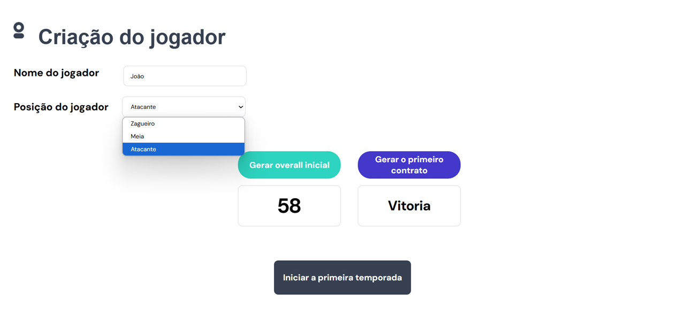
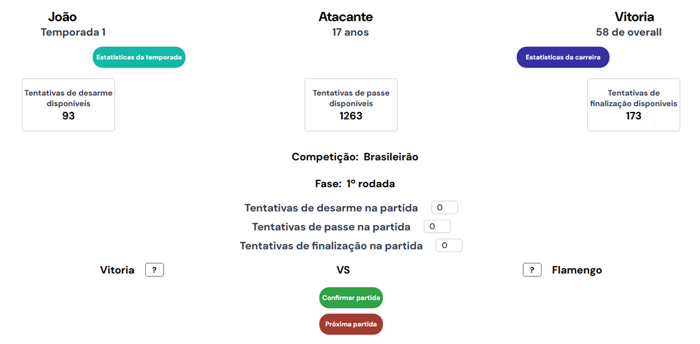
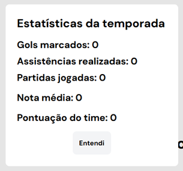
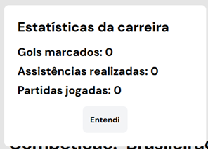
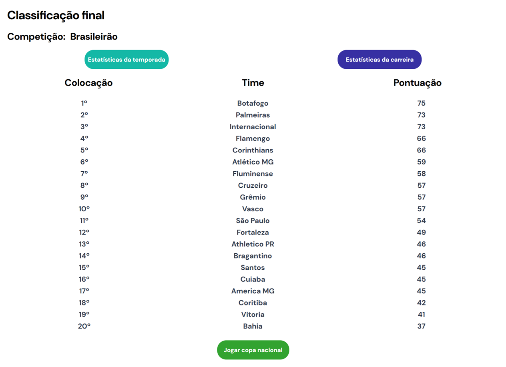
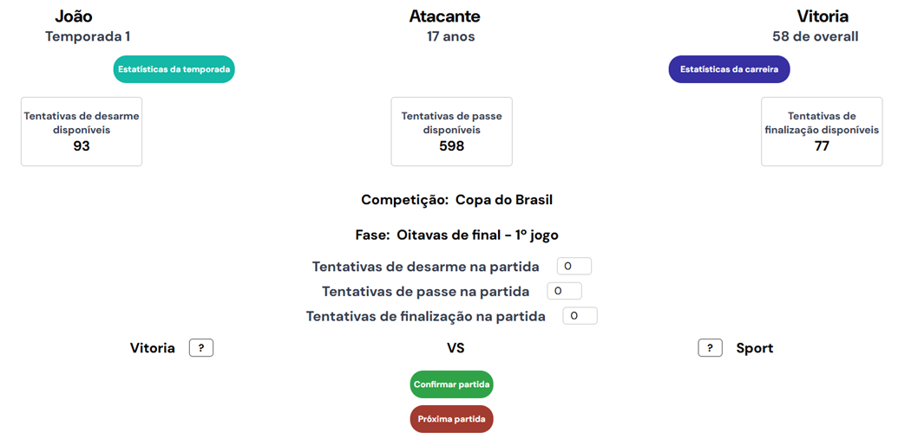
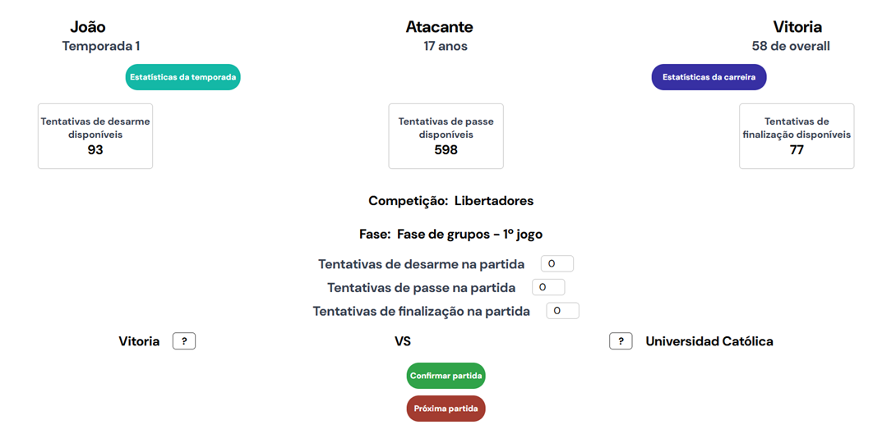
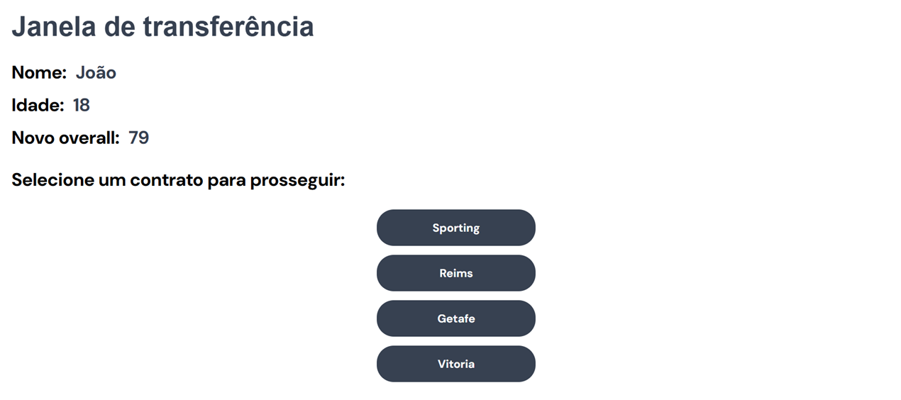

# 🎮 Carreira de jogador de futebol

## 📋 Sumário

1. [Descrição Geral]()
2. [Tecnologias Utilizadas]()
3. [Instalação e Execução]()
4. [Estrutura de Diretórios]()
5. [Como jogar]()
6. [Regras de negócio do jogo]()
7. [Autores e Créditos]()

---

## 🧾 Descrição Geral

> Através deste jogo, você é capaz de simular a carreira de um jogador de futebol profissional, vivenciando a carreira do atleta desde o início de sua jornada, até a aposentadoria.

---

## 🛠️ Tecnologias Utilizadas

- Frontend: ⚛️React.js, 🟢 Node.js, 🟦 TypeScript;
- Outras libs: ⚡Vite

---

## 🧪 Instalação e Execução

### Requisitos

- 🟢 Node.js >= 20;
- 📦 npm.

### Como rodar

Primeiro é necessário realizar a instalação de todas as dependências do projeto. Para fazer isso, basta rodar o seguinte comando na pasta raiz:

> npm install

Após as dependências serem instaladas, execute o projeto com o sseguinte comando:

> npm run dev

Em seguida acesse o endereço informado pelo Vite no prompt de comando. O endereço informado será algo como: http://localhost:5173/

---

## 📁 Estrutura de Diretórios

Abaixo está a estrutura de pastas atual do projeto:

```
📦 raiz do projeto
 ┣ 📂data
 ┃ ┣ 📂continentalCups
 ┃ ┣ 📂nationalCups
 ┃ ┣ 📂nationalLeagues
 ┃ ┗ 📂player
 ┣ 📂gameLogics
 ┣ 📂interfaces
 ┣ 📂node_modules
 ┣ 📂public
 ┃ ┗ 📂fonts
 ┣ 📂src
 ┃ ┣ 📂components
 ┃ ┣ 📂pages
 ┃ ┗ 📂style
 ┗ 📂utils
```

## ✏️ Descrição das Principais Pastas

- `data/`: Contém os dados utilizados pelo jogo, como ligas, copas e informações relevantes para criação e evolução do jogador.
- `gameLogics/`: Regras e lógicas centrais do jogo.
- `interfaces/`: Tipagens e definições de estrutura (útil com TypeScript).
- `public/fonts/`: Fontes públicas usadas na interface.
- `src/components/`: Componentes reutilizáveis da UI.
- `src/pages/`: Páginas principais da aplicação.
- `src/style/`: Estilos globais ou separados.
- `utils/`: Funções utilitárias genéricas.
- `node_modules/`: Dependências instaladas via npm.

## 🕹️ Como jogar

A ideia do jogo é simples. Você é um jogador de futebol profissional que deseja crescer na carreira e chegar ao topo do esporte. Para isso, você percorrerá a carreira de um atleta desde o seu início até a aposentadoria.

### 🧑‍⚽ Criação do jogador

No início deverá criar o jogador, informando o nome, posição (zagueiro, meio campista ou atacante) e gerando o overall inicial do atleta e o primeiro contrato.



Após isso, será iniciada a primeira temporada. O jogador será redirecionado à tela de jogo em si.

### 🏟️ Liga nacional



A primeira competição que o jogador participará será a liga nacional que seu clube participa (campeonato brasileiro, italiano, francês, etc.)

Ele poderá participar de todas as rodadas da liga (caso não sofra lesões).

No cabeçalho da tela, serão listadas as seguintes informações:

- Nome do jogador;
- Posição do jogador;
- Clube do jogador;
- Temporada corrente;
- Idade do jogador (inicia aos 17 anos);
- Overall do jogador (diz respeito à habilidade do atleta).

Na mesma tela, é possível acessar às estatísticas da temporada e da carreira.

Ao clicar em "Estatísticas da temporada", é aberto o seguinte modal:



E as seguintes informações são listadas:

- Goals marcados pelo jogador na temporada;
- Assistências realizadas pelo jogador na temporada;
- Partidas jogadas pelo jogador ao longo da temporada;
- Nota média do jogador durante toda a temporada;
- Pontuação do time do jogador na liga nacional.

E ao clicar em "Estatística da carreira", é aberto o seguinte modal:



As seguintes informações são listadas:

- Gols marcados pelo jogador ao longo de sua carreira;
- Assistências realizadas pelo jogador ao longo de sua carreira;
- Partidas jogadas pelo jogador ao longo de sua carreira.

Também são exibidas as tentativas de lance disponíveis para o usuário. Os lances podem ser:

- Tentativa de desarme;
- Tentativa de passe;
- Tentativa de finalização.

Estes lances são sorteados no início de cada temporada e são limitados, portanto o jogador deverá utilizá-los sabiamente.

É através destas tentativas que ele pode evitar gols adversários, dar assistências e até mesmo fazer gols.

### 📊 Classificação final

Ao final de cada liga nacional, será informada a classificação final dos clubes como pode ser visto abaixo:



A pontuação dos clubes funciona da seguinte forma:

- A pontuação do clube do jogador será baseada na soma dos pontos obtidos ao longo do campeonato, sendo que uma vitória acrescerá 3 pontos, um empate acrescerá 1 ponto e uma derrota não adicionará nenhum ponto ao clube;
- A pontuação dos demais clubes será baseada em um sorteio aleatório dos pontos dos mesmos, porém seguirão uma lógica;
- Caso o time do jogador atinja a sexta colocação ou superior, poderá jogar a copa continental (libertadores ou champions league).

Após isso, o jogador poderá clicar em "Jogar copa nacional" e será redirecionado para a tela correspondente.

### 🏆 Copa nacional

Cada liga possui uma copa correspondente e o jogador irá atuar com seu clube nesta copa. É possível ver a tela de copa nacional abaixo:



A estrutura é a mesma utilizada para os jogos da liga.

A copa nacional é trilhada pela seguinte jornada:

- Oitavas de final;
- Quartas de final;
- Semi final;
- Final.

Cada fase da copa, possui 2 jogos (ida e volta) e o clube que sobrepor ao outro no placar avança de fase. Caso haja um empate, o jogo é decidido nos pênaltis. Vale ressaltar que nos pênaltis não há interferência humana e o resultado é totalmente randômico.

As oportunidades de lance do jogador não são renovadas no início da copa nacional, portanto, ele deverá administrar muito bem as mesmas.

Após ser eliminado ou campeão da copa nacional, o jogador poderá ser redirecionado à tela onde jogará a copa continental (libertadores ou champions league) ou à janela de transferências.

### 🌍 Copa continental

Cada liga possui uma copa continental correspondente e o jogador irá atuar com seu clube nesta copa caso tenha se classificado. É possível ver a tela de copa continental abaixo:



A estrutura é a mesma utilizada para os jogos da liga e da copa nacional.

A copa continental é trilhada pela seguinte jornada:

- **Fase de grupos**: seis jogos com três adversários. Os primeiros dois colocados avançam para as oitavas de final;
- **Oitavas de final**: dois jogos (ida e volta) contra um adversário;
- **Quartas de final**: dois jogos (ida e volta) contra um adversário;
- **Semi final**: dois jogos (ida e volta) contra um adversário;
- **Final**: jogo único contra um adversário.

Durante o mata-mata, o clube que sobrepor ao outro no placar avança de fase. Caso haja um empate, o jogo é decidido nos pênaltis.

As oportunidades de lance do jogador não são renovadas no início da copa continental, portanto, ele deverá administrar muito bem as mesmas.

Após ser eliminado ou campeão da copa continental, o jogador será redirecionado à janela de transferências.

### 🔁 Tela de transferências

Ao final de toda temporada, o jogador poderá se transferir para um novo clube. Ele terá a oportunidade de assinar com outros três clubes e dependendo da situação renovar com o clube que já atua.



Algumas informações são listadas no cabeçalho:

- Nome do jogador;
- Nova idade do jogador;
- Novo overall do jogador.

---

## 📜 Regras de negócio do jogo

### 🟩 vs 🟥 Resultado das partidas

As partidas não jogadas pelo usuário, terão um sistema de resultado baseado em duas variáveis:

- Diferença de potencial entre os clubes (lembrando que a força dos clubes pode variar temporada à temporada);
- Aleatoriedade;

Já as partidas que forem jogadas pelo usuário, poderão ter seu resultado afetado pelo desempenho do jogador do usuário, sendo que:

- A cada 10 desarmes bem sucedidos, 1 gol adversário é decrescido;
- A cada 40 passes bem sucedidos, 1 assistência é realizada;
- O jogador pode fazer gols, afetando o resultado da partida.

### 📈 Pontuação do jogador

A nota inicial do jogador da partida é de 6,0. Esta nota pode baixar ou aumentar baseado no desempenho do atleta. A pontuação do jogador será baseada nas estatísticas do mesmo, sendo que:

Para aumentar a nota do jogador na partida:

- A cada desarme bem sucedido, é acrescido 0,2 na nota do atleta;
- A cada passe bem sucedido, é acrescido 0,05 na nota do atleta;
- A cada finalização bem sucedida, é acrescido 0,5 na nota do atleta.
- A cada assistência, é acrescido 2,0 na nota do atleta;
- A cada gol, é acrescido 3,0 na nota do atleta;

Para diminuir a nota do jogador na partida:

- A cada desarme mal sucedido, é descrescido 0,15 na nota do atleta;
- A cada passe bem sucedido, é descrescido 0,1 na nota do atleta;
- A cada finalização bem sucedida, é descrescido 0,1 na nota do atleta.

### 🎲 Probabilidade de sucesso em uma jogada

A probabilidade de sucesso em uma jogada é baseada no overall do atleta e de sua posição. É possível ver a probabilidade de sucesso de uma jogada baseada por posição e overall na seguinte tabela:

| Posição  | Prob. Acerto por Desarme | Prob. Acerto por Passe | Prob. Acerto por Finalização | Prob. Acerto por Gol |
| -------- | ------------------------ | ---------------------- | ---------------------------- | -------------------- |
| Zagueiro | 70% do Overall           | 85% do Overall         | 20% do Overall               | 30% do Overall       |
| Meia     | 50% do Overall           | 90% do Overall         | 30% do Overall               | 40% do Overall       |
| Atacante | 20% do Overall           | 80% do Overall         | 50% do Overall               | 50% do Overall       |

### 🚀 Evolução de overall

A evolução de overall depende diretamente da média de notas do atleta durante a temporada e de sua idade.

O overall padrão para cada idade é a seguinte:

| Idade | Overall Mínimo | Overall Máximo |
| ----- | -------------- | -------------- |
| 17    | 55             | 65             |
| 18    | 62             | 75             |
| 19    | 70             | 78             |
| 20    | 75             | 82             |
| 21    | 78             | 85             |
| 22    | 80             | 88             |
| 23    | 83             | 89             |
| 24    | 83             | 89             |
| 25    | 84             | 90             |
| 26    | 84             | 90             |
| 27    | 83             | 90             |
| 28    | 83             | 90             |
| 29    | 82             | 88             |
| 30    | 82             | 87             |
| 31    | 80             | 86             |
| 32    | 78             | 84             |
| 33    | 75             | 83             |
| 34    | 73             | 78             |
| 35    | 70             | 75             |
| 36    | 67             | 72             |
| 37    | 63             | 68             |
| 38    | 59             | 64             |
| 39    | 55             | 62             |
| 40    | 54             | 61             |

O overral pode sofrer um acréscimo a depender da nota média do jogador no ano anterior, sendo que este funciona da seguinte forma:

| Nota Média do Jogador | Acréscimo de Overall |
| --------------------- | -------------------- |
| 9,01 - 10,0           | 10                   |
| 8,51 - 9,0            | 9                    |
| 8,01 - 8,5            | 8                    |
| 7,51 - 8,0            | 6                    |
| 7,01 - 7,5            | 5                    |
| 6,51 - 7,0            | 4                    |
| 6,01 - 6,5            | 2                    |
| 5,01 - 6,0            | 1                    |
| 0,00 - 5,0            | 0                    |

### 💡 Quantidade de oportunidades por temporada

Ao início de cada temporada, será setada a quantidade de oportunidades que o jogador terá para toda a sua temporada, essas oportunidades são as seguintes:

- Tentativas de desarme;
- Tentativas de passe;
- Tentativas de finalização.

A quantidade de oportunidades para cada ação poderá variar conforme a posição e overall do atleta. No início de cada temporada, haverá um sorteio de quantas oportunidades o jogador terá. Na tabela abaixo é possível ver como será a faixa deste sorteio:

| Oportunidade              | Zagueiro    | Meia        | Atacante    |
| ------------------------- | ----------- | ----------- | ----------- |
| Tentativas de desarme     | 610 - 650   | 320 à 350   | 80 - 88     |
| Tentativas de passe       | 1590 - 1770 | 2400 - 2650 | 1200 - 1320 |
| Tentativas de finalização | 38 - 44     | 90 - 132    | 160 à 176   |

O overall do atleta será responsável por fazer com que a quantidade de oportunidades aumente. Nesta outra tabela é possível ver como o aumento de oportunidades será aplicado:

| Faixa de overall | Aumento de oportunidades |
| ---------------- | ------------------------ |
| 50 - 60          | 0%                       |
| 61 - 70          | 5%                       |
| 71 - 80          | 10%                      |
| 81 - 90          | 15%                      |
| 91 - 100         | 20%                      |

### 🧑‍⚽ ➡️ 🧑‍⚽ Janela de transferências

A janela de transferência do jogador será baseada no overall do mesmo, no overall dos clubes.

#### 🔄📉 Venda do jogador por falta de overall individual

Ao longo das temporadas, o jogador aumentar e diminuir seu overall. Com isto em vista, é possível que o mesmo atinja um nível de overall abaixo do mínimo necessário para continuar em seu clube atual. Caso isso aconteça, ele será obrigado a ir para um novo clube em que seu overall seja o suficiente.

#### 🏠 Possibilidade de continuar no mesmo clube

Caso o jogador possua um overall mínimo necessário para continuar em seu clube, ele poderá continuar.

#### 📝⚽ Lista de clubes para tranferência

A cada temporada o jogador terá uma lista de 3 clubes que oferecerão propostas ao mesmo. Serão três clubes cujo o overall mínimo aceitável para se jogar no clube é cumprido pelo atleta.

A(s) nacionalidade(s) desses clubes será feita por sorteio. E os clubes também, portanto mesmo que o jogador possua um overall alto, ele não poderá escolher os clubes dessa lista, somente a decisão final.

### 🤕 Probabilidade do jogador não participar de uma partida

O jogador poderá não participar de uma partida. Isto ocorrerá por meio de sorteio e idade, gerando uma pequena lesão ao atleta. A probabilidade do atleta não participar de um jogo pode ser visto na tabela abaixo:

| Faixa de Idade do Jogador | Probabilidade de Lesão por Partida |
| ------------------------- | ---------------------------------- |
| 17 - 20                   | 5%                                 |
| 21 - 25                   | 10%                                |
| 26 - 30                   | 15%                                |
| 31 - 35                   | 20%                                |
| 36 - 37                   | 25%                                |
| 38 - 39                   | 30%                                |
| 40                        | 35%                                |

## 👥 Autores e Créditos

- João Ferreira – Desenvolvedor

---
